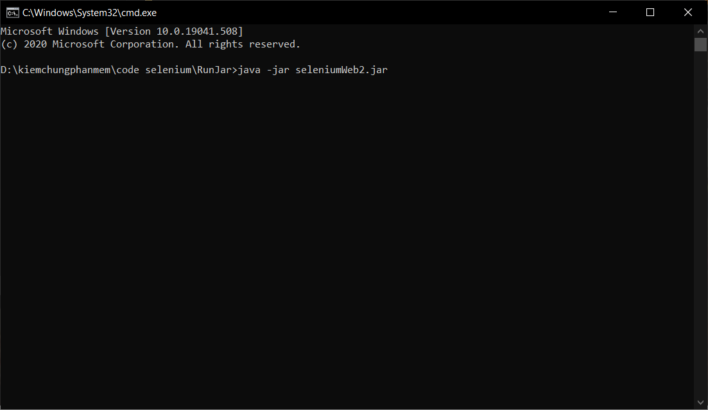
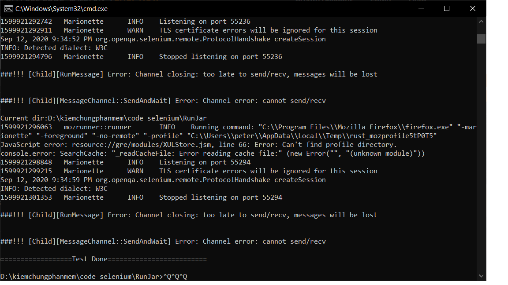

++++++++++++++++++++ Hướng Dẫn sử dụng +++++++++++++++++++++++++++ 
1 Kiến trúc 
Read File Excel Testcase - File input data. 
Run selenium 
Write file result test, file log4j. 
2 Cấu trúc thư mục 
Parent Folder: 
DataInput (thư mục chứa file input dataTestCase, Thư mục đã chứa file input Data Sẵn) 
ResultTest (thư mục chứa file resutl sau khi selenium đã run xong) 
SourceCode (thu mục chứa source code) 
Testcase (thư mục chứa file test case,thư mục đã chứa testCase ) 
RunJar (thư mục chứa file jar để run trực tiếp) 
3 Run selenium 
Đang ở vị trí thư mục RunJar 
cmd : java -jar seleniumWeb2.jar 
 
 
Video Demo: 
Test Create Accout User: <a href="https://youtu.be/PAS39Ga6MXI">https://youtu.be/PAS39Ga6MXI</a> 
Test Login User: <a href="https://youtu.be/EZoRWydz3R8">https://youtu.be/EZoRWydz3R8</a> 
chú ý: 
Máy phải đã cài java, version 8 trở lên 
Máy đã cài FireFox 
Máy dã deploy server: localhost/supermarketv3/ 
Dự định tiếp theo sẽ ra version tiếp theo: 
chạy theo server tự chọn 
chạy theo trình duyệt web tự chọn. 
Cảm ơn. Chúc thành công.

